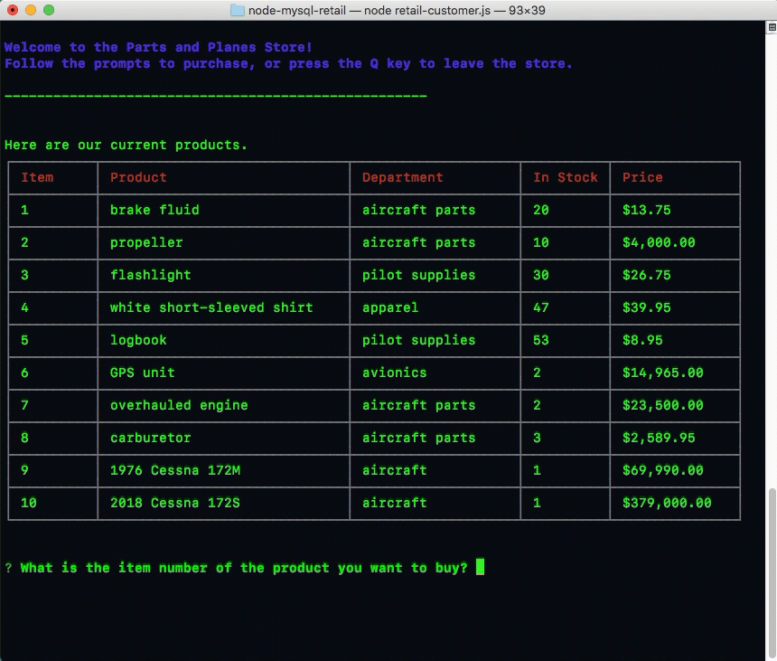

# Command-line retail inventory

This is a command-line Node.js and MySQL app for buying and tracking retail inventory for an aircraft parts and supplies store.

## Set up and installation

These must be installed to access the store:

- [Node.js](https://nodejs.org/en/)
- [npm](https://www.npmjs.com/get-npm)

## Enter the store

In a terminal window, navigate into the folder where you downloaded this app and type `node retail-customer.js`.

You will see a table of the current products available for purchase, which represents the data stored in a MySQL database. Following the prompts, type the item number of the product you want to buy and the quantity. 

If there is enough inventory available in the store, you can buy the product and see your total cost. The quantity in the database is updated to reflect your purchase.

Unfortunately, if the store does not have enough of the item to fill your order, your purchase will be declined. 

You can type `Q` to leave the store at any time.

## Technology

- JavaScript
- Node.js
- npm, including [inquirer](https://www.npmjs.com/package/inquirer), [node-mysql](https://www.npmjs.com/package/node-mysql), [cli-table2](https://www.npmjs.com/package/cli-table2) and [chalk](https://www.npmjs.com/package/chalk) packages